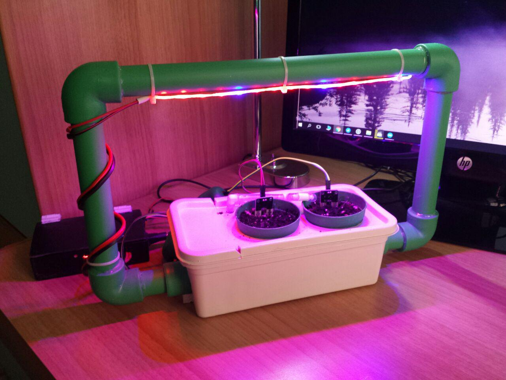
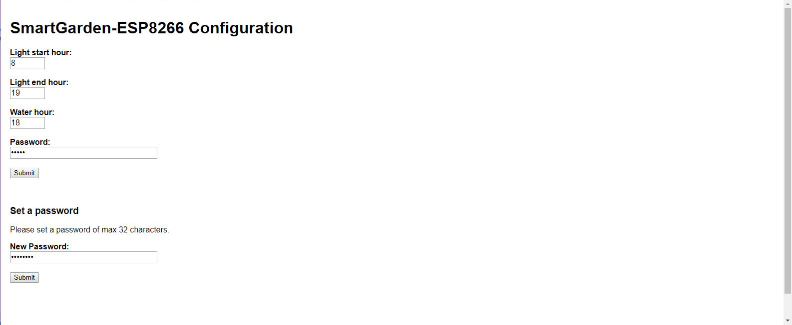

# SmartGarden-ESP8266
Smart Garden project controlled by ESP8266.

This program runs a little automated garden provided with artificial light and water tank, to grow small plants in an indoor context with very little human supervision. The garden will turn on the light based on time and user configuration, and will water the pots based on soil moisture and the water tank fill level. All you have to do is refill the water tank from time to time.

 

## Information

This program runs on a ESP8266 module. 

The pin used are:

D0/GPIO 16: Moisture sensor in water tank

D1/GPIO 5: Moisture sensor in pot

D2/GPIO 4: Moisture sensor in pot

D3/GPIO 0: Led input

D4/GPIO 2: Water pump input

D6/GPIO 12: Password reset button input

## Usage

The user can set the Wi-Fi SSiD and password connecting to the NodeMCU local network and then access http://192.168.4.1 to configure.

The user can configure the garden via web. The esp8266 runs a server to collect configuration data.
Access http://192.168.1.94:8080, then complete the form to choose lights start and stop hours and watering hour.

The user can set a security password too. It will only be required after setting it, and can be reset pressing a physical button on the device.

 
